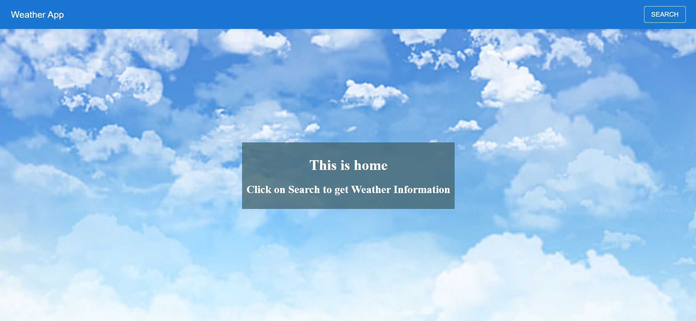
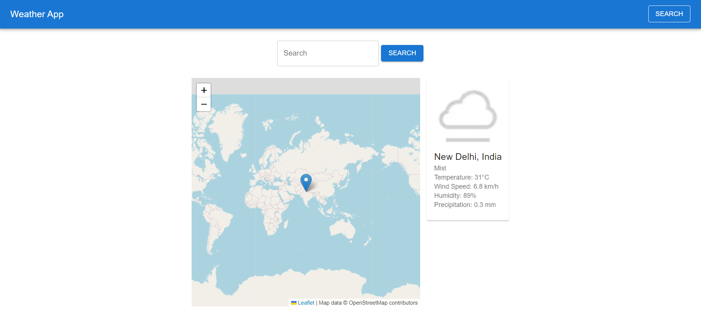

# Weather App

This is a weather data application built with React.js, Material-UI components, Axios, React Router, and the WeatherAPI.

## Features

- Allows users to search for weather data by city or country.
- Displays current weather information, including temperature, condition, wind speed, humidity, and precipitation.
- Shows the location on a map using MapContainer from the react-leaflet library.

## Prerequisites

- Node.js and npm should be installed on your machine.

## Installation

1. Clone the repository:
   ```shell
   git clone https://github.com/your-username/your-repo.git

2. Navigate to the project directory:

    cd your-repo

3. Install the dependencies:

    npm install
Obtain an API key from WeatherAPI and insert it in the getWeather function located in the services file.

### Usage
Start the development server:

    npm run dev
Open your web browser and navigate to http://localhost:5173 to access the application.

Click on Search to Search, Enter a city or country in the search bar and click the "Search" button to view the weather data and location on the map.

## Screenshots

*Caption: Home page*


*Caption: Weather Information page*


### Contributing
Contributions are welcome! Please open an issue or submit a pull request with any enhancements or bug fixes.
